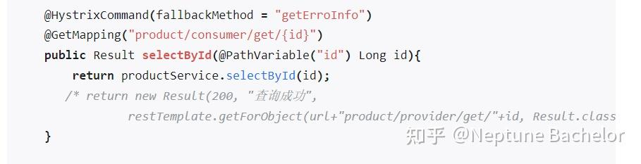
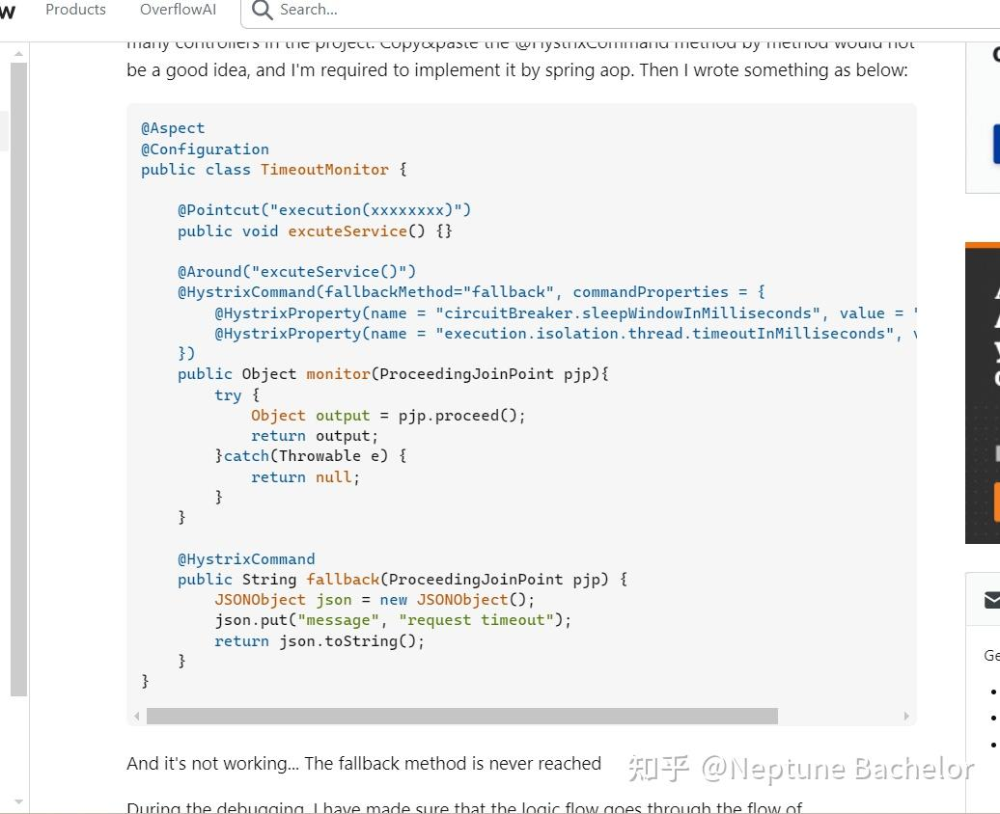

# Spring Boot 项目配合Hystrix 实现全局RestController超时熔断（api超过30秒返回timeout)

 **Author:** [Neptune Bachelor]

 **Link:** [https://zhuanlan.zhihu.com/p/709892311]

## 需求：  
项目需要在中间层加一个超时熔断，避免某些service用时太长，block住user太久，同时也可能会有太多request堵塞导致服务器卡死。

项目的已经写好的controller 非常多（十几个），里边的request就更多了（平均每页十几个mapping）

## 背景：  
### 超时熔断，根据项目不同，有几种实现方式  
* Spring Cloud 微服务：直接用现成的circuitbreaker，配合resilience4j。 缺点时需要将项目改造成spring cloud项目，api request会现进入断路器所在cloud service，然后在进去业务所在的springboot项目
* hystrix：hystrix是Netflix的一个断路器包，GitHub上显示它现在处于维护状态，应该不会活跃更新了。
* 将controller改为异步方法

## 网上的用法  
@HystrixCommand 注解  
可以参考这篇文章 [https://zhuanlan.zhihu.com/p/498105315](https://zhuanlan.zhihu.com/p/498105315)  
非常详细

  


是可以work的，application里配置了默认的超时时间

  
  
但是呢，这样设置的话，需要给每个controller都加上HystrixCommand，才能生效。对于我的项目，有上百个api的话，工作量是相当巨大。那么有没有更方便的设置呢？

我一开始是想到用apsect 切面，@Around包住RestController，在切面里边，配置@HystrixCommand。GPT根据需求帮我生成了一个配置文件。  


[https://stackoverflow.com/questions/47435953/how-to-use-hystrixcommand-inside-a-spring-aop-class/78771572#78771572](https://stackoverflow.com/questions/47435953/how-to-use-hystrixcommand-inside-a-spring-aop-class/78771572#78771572)

  


HystrixCommand的标准用法，作者尝试配合Aspect切面使用

  
  
  
StackOverFlow的作者没有找到合适的解决方法，他优化了原来一大串的配置，写到了application.yml里，


```
@HystrixCommand(fallbackMethod="fallback")
```
这样每个api上边的注解就不会那么长而已。

## 改进  
推测HystrixCommand也是类似切面的方式，实现熔断的，所以二者产生了冲突。通过检索相关Hystrix源码分析，有相关线索。  
根据经验，注解不生效的时候，通过实例话，一般能更好的debug和控制。于是让gpt提供一个create instance的方式实现HystrixCommand，果然成功实现全局超时熔断。

### 只要加一个配置文件  

```
import com.netflix.hystrix.HystrixCommand;
import com.netflix.hystrix.HystrixCommandGroupKey;
import com.netflix.hystrix.HystrixCommandKey;
import com.netflix.hystrix.HystrixCommandProperties;
import org.aspectj.lang.ProceedingJoinPoint;
import org.aspectj.lang.annotation.Around;
import org.aspectj.lang.annotation.Aspect;
import org.aspectj.lang.reflect.MethodSignature;
import org.springframework.http.HttpStatus;
import org.springframework.http.ResponseEntity;
import org.springframework.stereotype.Component;

import javax.servlet.http.HttpServletResponse;

@Aspect
@Component
public class CustomHystrixCommandAspect {

    private final HttpServletResponse response;

    public CustomHystrixCommandAspect(HttpServletResponse response) {
        this.response = response;
    }

    @Around("execution(* com.vibrant_america.billing.controller..*(..))")
    public Object aroundControllerMethods(ProceedingJoinPoint joinPoint) throws Throwable {
        HystrixCommand.Setter setter = HystrixCommand.Setter
                .withGroupKey(HystrixCommandGroupKey.Factory.asKey("ControllerGroup"))
                .andCommandKey(HystrixCommandKey.Factory.asKey(joinPoint.getSignature().getName()))
                .andCommandPropertiesDefaults(HystrixCommandProperties.Setter()
                        .withExecutionTimeoutInMilliseconds(29000));

        return new HystrixCommand<Object>(setter) {
            @Override
            protected Object run() throws Exception {
                try {
                    return joinPoint.proceed();
                } catch (Throwable throwable) {
                    throw new Exception(throwable);
                }
            }

            @Override
            protected Object getFallback() {
                return ResponseEntity.status(HttpStatus.REQUEST_TIMEOUT).body("Request timed out");
            }
        }.execute();
    }
}

```
  


### pom文件里添加hystrix注解就好了  

```
        <dependency>
            <groupId>org.springframework.cloud</groupId>
            <artifactId>spring-cloud-starter-netflix-hystrix</artifactId>
            <version>2.2.10.RELEASE</version>
        </dependency>
```
  


### 测试  

```
    @GetMapping("/over30stest")
    public ResponseEntity<Void> testOver30s() throws InterruptedException {

        String threadName = "testten";
        Thread.currentThread().setName(threadName);
        Thread.sleep(1000 * 40);
        System.out.println("40s done");
        return new ResponseEntity<>(HttpStatus.OK);
    }
```
注意返回值最好用ResonseEntity， 它能主动控制reponseCode。

void，string或者其他类型的返回值，在超时getFallback的时候，会造成返回 code 200的bug。

2024-07-25 优化：


```
// 获取当前请求的HttpServletResponse对象
RequestAttributes requestAttributes = RequestContextHolder.getRequestAttributes();
HttpServletResponse response = ((ServletRequestAttributes) requestAttributes).getResponse();

@Override
protected Object getFallback() {
 // 仅在特定Hystrix异常情况下处理
 Throwable failureCause = getExecutionException();
 if (failureCause instanceof HystrixTimeoutException) {
 log.error("Fallback for method: " + joinPoint.getSignature().getName() + " due to timeout");

        Map<String, String> responseBody = new HashMap<>();
        responseBody.put("reason", "request time out");
 if (returnType.isAssignableFrom(ResponseEntity.class)) {
 return ResponseEntity.status(HttpStatus.REQUEST_TIMEOUT).body("Request timed out");
        } else {
 response.setStatus(HttpStatus.REQUEST_TIMEOUT.value());
 return responseBody;
        }
    } else {
 // 其他异常交给全局异常处理器
 throw new RuntimeException(failureCause);
    }
}
```
这样就可以无痕处理非responseEntity返回值的api mapping了

### 结果  
  


设置的是29秒超时

  
  
## 经验  
注解方便简单，但控制不好容易产生问题。在注解不work或者效果不好的时候，create private instance往往更简单清晰，同时更方便调试注入的bug。

springboot 的starter 相关的包也是同理。他们往往能快速脚手架化的搭起一个项目，但是颗粒化的精细控制往往很麻烦，甚至无法控制。

